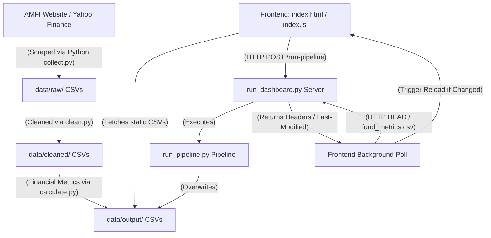

# Project Architecture & Component Guide: Mutual Fund Dashboard

This document provides a comprehensive guide to the files, architecture, and technology stack used in the **Mutual Fund Dashboard** project. It explains what each file does, why specific technologies were chosen, and how data flows from raw web scraping down to the frontend visualization.

---

## 1. System Architecture Overview

The application is split into two primary layers:
1. **Data Ingestion & Processing Pipeline (Python Backend)**: Handles web scraping, data cleaning, and financial metrics calculation (CAGR, Sharpe, Volatility).
2. **Interactive Visual Dashboard (HTML/CSS/JS Frontend)**: A high-density, minimalist, glassmorphic UI that visualizes the metrics, renders comparative charts, supports scheme selection, and embeds Power BI reports.

They communicate locally through a lightweight Python web server that coordinates endpoint execution and serves the updated datasets.



---

## 2. Component Breakdown & File Uses

### 📄 `index.html` (The Structure)
* **What it does**: Defines the structure and layout of the single-page application (SPA).
* **Key Sections**:
  - **Top Navigation Bar**: Hosts the brand title, navigation tabs (Screener, Visuals, Compare, Power BI), and the **Sync Data** action button.
  - **Metrics Widgets**: A row of high-level overview cards displaying top CAGR, highest Sharpe ratio, lowest volatility, and active universe size.
  - **Screener Page**: Hosts filters (search bar, category dropdown, asset manager dropdown) and the high-density **Screener Table** where users can select funds.
  - **Performance Visuals Page**: Containers for Chart.js canvases (Risk vs Return scatter plot, AUM bar chart, and rolling performance line charts).
  - **Compare Page**: A dynamically populated side-by-side card grid comparing selected schemes.
  - **Power BI Connection Page**: Interface to manage local database links and embed public Power BI Web dashboards.
  - **Floating Compare Drawer**: A sticky bar that slides up from the bottom when funds are checked, allowing the user to initiate comparison.

### 📄 `index.css` (The Design & Style)
* **What it does**: Applies styling, responsive grid structures, and modern aesthetics to the dashboard.
* **Key Styling Systems**:
  - **Glassmorphism**: Employs semi-transparent backdrops (`backdrop-filter: blur()`), subtle border glows, and soft drop shadows to create a premium, clean, human-designed look.
  - **Color Palette**: Uses HSL-tailored colors representing financial states (e.g., cyan/amber/blue/indigo for categories, emerald-green for profits, and red/rose for drawdowns).
  - **Typography**: Imports clean Google Fonts (Inter) and scales typography to emphasize data hierarchy.
  - **Transitions & Animations**: Adds subtle hover transformations (e.g., table row glows, button scales, and fade-in transitions) and a pulse animation for the active connection indicators.

### 📄 `index.js` (The Logic & Interactivity)
* **What it does**: Acts as the orchestrator of the frontend. It manages application state, dynamically builds table rows, configures charts, routes pages, and tracks file modifications.
* **Why JavaScript is Used**:
  - **Dynamic DOM Manipulation**: Populates selectors and injects rows into the screener table and comparison grid based on user choices without forcing browser page reloads.
  - **State Management**: Keeps track of active filters (search text, category, AMC), active sorting columns (descending/ascending), and checked fund codes.
  - **Data Visualization**: Feeds the parsed CSV arrays into **Chart.js** configurations to render interactive charts.
  - **Persistent Embeds**: Manages reading and writing the Power BI embed URL in the browser's `localStorage`.
  - **Live Auto-Refresh Polling**: Contains the loop that monitors server file modifications to execute seamless, in-place reloads.

### 📄 `run_dashboard.py` (The Local Web Server)
* **What it does**: Launches a lightweight HTTP server on `http://localhost:8000`.
* **Key Functions**:
  - **Static File Hosting**: Serves the HTML, CSS, and JS files, alongside the `data/` subfolders to the browser.
  - **Cache Control**: Appends custom HTTP headers (`Cache-Control: no-cache, no-store, must-revalidate`) in `end_headers()` to disable browser caching so that new data runs are seen instantly.
  - **Pipeline Bridge**: Listens for `POST` requests at the `/run-pipeline` endpoint. When triggered, it spawns `run_pipeline.py` as a subprocess and returns a JSON response indicating success or failure.

### 📄 `run_pipeline.py` (The Pipeline Master)
* **What it does**: The central execution script for the data pipeline. It performs system preflight checks (verifying standard files exist and required Python packages like `requests`, `pandas`, and `numpy` are installed) and runs the ingestion stages sequentially.

---

## 3. How Python Collects Data & Syncs to the Frontend

The ingestion and synchronization flow is fully automated. Below is a breakdown of how data travels from the internet to the browser:

### Stage 1: Data Collection (`collect.py`)
- Contacts the official Association of Mutual Funds in India (**AMFI**) API to download the complete raw text database of daily NAV (Net Asset Value) histories for all active schemes.
- Uses the **Yahoo Finance (`yfinance`)** library to scrape historical stock price data for the underlying index benchmarks (e.g., Nifty 50, Nifty Midcap 150, Nifty Smallcap 250).
- Stores these raw files inside `data/raw/`.

### Stage 2: Data Cleaning (`clean.py`)
- Reads the raw files from `data/raw/`.
- Standardizes columns, cleans up irregular string names, parses dates, and handles formatting differences.
- Separates schemes into broad categories (Equity, Debt, Hybrid, Other) and saves clean files to `data/cleaned/`.

### Stage 3: Financial Metrics Calculation (`calculate.py`)
- Reads the cleaned historical data.
- Processes the NAV records day-by-day to calculate essential performance and risk metrics:
  - **1Y, 3Y, and 5Y CAGR**: Compounded annual growth rates.
  - **Volatility**: Standard deviation of daily returns.
  - **Sharpe, Sortino, & Calmar Ratios**: Risk-adjusted performance measures.
  - **Max Drawdown**: The peak-to-trough decline percentage.
  - **Composite Score**: An algorithmically computed ranking score out of 100 based on risk and returns.
- Writes the final compiled records to `data/output/fund_metrics.csv` and `data/output/rolling_returns.csv`.

---

## 4. How the "Sync Data" and Live Updates Work

```
 [User clicks Sync] ──> [JS POSTs to /run-pipeline] ──> [Server runs Python Pipeline] 
                                                                  │
 [JS live updates DOM] <── [JS Poll detects file change] <── [CSVs overwritten on disk]
```

### The Synchronization Link:
1. **User Request**: The user clicks the **Sync Data** button on the frontend.
2. **Subprocess Trigger**: JavaScript intercepts the click and sends an HTTP `POST` request to `http://localhost:8000/run-pipeline`.
3. **Execution**: The local python server intercepts the endpoint and runs `run_pipeline.py` synchronously.
4. **Data Overwritten**: The Python scripts scrape the latest web listings, compute new metrics, and overwrite `data/output/fund_metrics.csv` on the hard drive.
5. **Modification Detection**:
   - The frontend JavaScript runs a background timer every 5 seconds.
   - It sends a lightweight HTTP `HEAD` request to `data/output/fund_metrics.csv?t=Date.now()`.
   - The server responds with the headers of the file, including the `Last-Modified` timestamp.
   - The frontend JS compares this with its stored `lastKnownModifiedTime`.
6. **Dynamic Reload**: Since the file was overwritten, the timestamps will not match. The frontend automatically updates its state, executes `loadData()`, and redraws the UI and charts instantly. The user sees the fresh data in-place without the webpage reloading or flashing.
