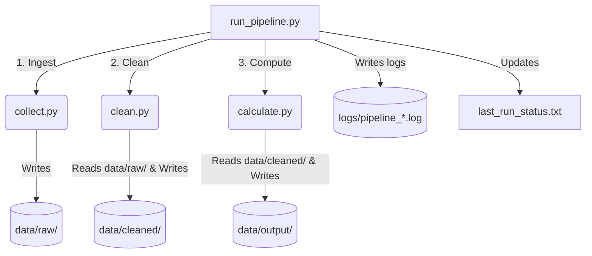

# Mutual Fund Data Pipeline

This repository contains the backend data pipeline for our Mutual Fund Analysis Dashboard. It collects raw mutual fund NAVs, cleanses and normalizes the data, computes key performance metrics (CAGR, Sharpe ratios, drawdowns), and prepares clean tables for front-end ingestion (like Power BI).

We refactored this codebase from an experimental Jupyter notebook into a clean, modular set of Python scripts that are reliable enough to run on a daily schedule.

---

## How It Works

The data pipeline runs in three sequential stages orchestrated by a master controller:



1. **Ingest (`collect.py`)**: Fetches historical mutual fund NAVs, scheme details, and index benchmarks using `yfinance` and public AMFI API endpoints. Writes raw data to `data/raw/`.
2. **Clean & Validate (`clean.py`)**: Validates the schemas, handles missing values, filters duplicates or faulty records, and runs integrity diagnostics. Saves cleaned data to `data/cleaned/`.
3. **Calculate (`calculate.py`)**: Computes core metrics (Sharpe ratio, 3-year CAGR, max drawdowns, rolling returns) and calculates performance ranks within categories. Saves final results to `data/output/`.

`run_pipeline.py` is the main entry point that ties these stages together, manages preflight checks, captures log files, and handles retries.

### Directory Layout

```text
mutual_fund_project/
├── collect.py             # Stage 1: Ingestion
├── clean.py               # Stage 2: Cleaning & validation
├── calculate.py           # Stage 3: KPI calculation
├── run_pipeline.py        # Pipeline orchestrator & runner
│
├── last_run_status.txt    # Summary of the most recent run (created on execution)
├── logs/                  # Text logs saved for debugging
└── data/
    ├── raw/               # Output from collect.py
    ├── cleaned/           # Output from clean.py
    └── output/            # Final CSVs ready for Power BI
```

---

## Getting Started

### Prerequisites
Make sure you have **Python 3.10+** and a package manager installed. We recommend setting up a virtual environment or Conda env:

```bash
# Create and activate environment
conda create -n mutual_fund_dashboard python=3.11 -y
conda activate mutual_fund_dashboard

# Install dependencies
pip install requests pandas numpy yfinance openpyxl xlrd
```

### Running the Pipeline

To run a full update (Ingest → Clean → Calculate):
```bash
python run_pipeline.py
```

To run a single stage for testing (without re-scraping or recalculating everything):
```bash
python run_pipeline.py --stage clean
```
To run preflight environment and dependency checks (without executing any pipeline code):
```bash
python run_pipeline.py --dry-run
```

By default, if a stage fails (e.g. due to a network timeout during ingestion), the runner will retry it up to 2 times after a short delay. You can disable this behavior during debugging:
```bash
python run_pipeline.py --no-retry
```

---

## Operational Details

- **Windows Console Safety**: Windows terminals using `CP1252` encoding typically crash with `UnicodeEncodeError` when scripts print special symbols (like checkmarks or arrows). The logging in this repository is explicitly restricted to safe ASCII characters (`[OK]`, `[FAIL]`, `[WARN]`, `->`) to guarantee robust terminal execution.
- **UTF-8 Override**: The pipeline dynamically injects `PYTHONIOENCODING=utf-8` to child processes to ensure standard libraries parsing external sources do not trigger encoding failures.
- **Monitoring status**: Each execution updates `last_run_status.txt` with a single line (e.g., `SUCCESS | 2026-05-21 02:07:46 | Duration: 1m 12s`). You can use this file to trigger alerts or verify updates before refreshing dashboards.
